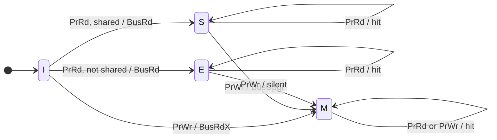
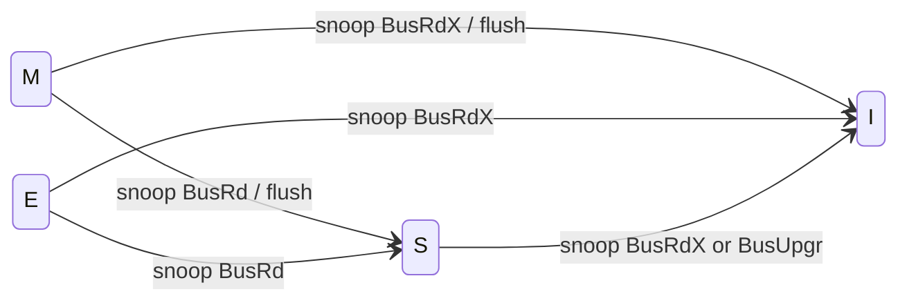
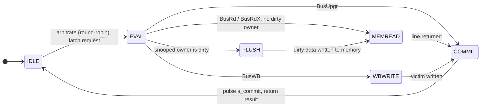

# MESI protocol reference

This document specifies the coherence protocol implemented by `l1_cache.sv` and
the atomic snoop bus in `snoop_bus.sv`. Every transition below corresponds
directly to RTL; the testbenches in `tb/` exercise each one.

## States

| State | Name       | Data     | Other copies | Notes                                   |
|:-----:|------------|----------|--------------|-----------------------------------------|
| **M** | Modified   | dirty    | none         | only valid copy; memory is stale        |
| **E** | Exclusive  | clean    | none         | only cached copy; matches memory        |
| **S** | Shared     | clean    | may exist    | one of possibly several read-only copies|
| **I** | Invalid    | –        | –            | not present                             |

## Bus commands

| Command      | Issued for                              | Memory effect                    |
|--------------|-----------------------------------------|----------------------------------|
| **BusRd**    | read miss (wants data, may share)       | read line (after any flush)      |
| **BusRdX**   | write miss / read-for-ownership         | read line (after any flush)      |
| **BusUpgr**  | write hit in S (invalidate sharers only)| none                             |
| **BusWB**    | write back a dirty victim on eviction   | write line                       |

## Processor-side transitions

Driven by the local CPU's load (`PrRd`) or store (`PrWr`).

| From | Event  | Bus action           | To  |
|:----:|--------|----------------------|:---:|
| I    | PrRd   | BusRd, `shared`=0    | E   |
| I    | PrRd   | BusRd, `shared`=1    | S   |
| I    | PrWr   | BusRdX               | M   |
| S    | PrRd   | – (hit)              | S   |
| S    | PrWr   | BusUpgr              | M   |
| E    | PrRd   | – (hit)              | E   |
| E    | PrWr   | – (silent)           | M   |
| M    | PrRd   | – (hit)              | M   |
| M    | PrWr   | – (silent)           | M   |

## Snoop-side transitions

Driven by *another* core's transaction observed on the bus. A dirty owner (M)
also flushes its line to memory so the requester sees the up-to-date value.

| From | Observed command | Action        | To  |
|:----:|------------------|---------------|:---:|
| M    | BusRd            | flush to mem  | S   |
| M    | BusRdX           | flush to mem  | I   |
| E    | BusRd            | –             | S   |
| E    | BusRdX           | –             | I   |
| S    | BusRd            | –             | S   |
| S    | BusRdX           | –             | I   |
| S    | BusUpgr          | –             | I   |

## Atomic bus sequencer

The bus services one transaction end-to-end before starting the next, and owns
the single main-memory port. Each transaction walks:

During `EVAL` a wired-OR `shared` signal (the OR of the other caches' hit
outputs) decides whether a read miss installs **E** (nobody else has it) or
**S** (someone does).

## Concurrency and coherence races

Caches may issue requests simultaneously even though the bus itself is atomic.
Three races are resolved in `l1_cache.sv`:

* **Concurrent conflicting upgrade** — two cores in S both want M. One wins the
  bus with `BusUpgr`; the other is invalidated *mid-upgrade*. The loser detects
  its shared copy is gone (`have_shared` is false) and converts its `BusUpgr`
  into a full `BusRdX`, re-acquiring the line with ownership instead of
  promoting a stale copy to M.

* **Snoop-vs-lookup** — while another core's transaction is in flight on the
  exact line this cache's CPU FSM is examining, the lookup is held until that
  transaction commits and then remade against the post-snoop state.

* **Silent-write-vs-in-flight-snoop** — a local write hit that would complete
  silently (M→M / E→M) is *also* held for the whole in-flight snoop window on
  that line, not just the commit cycle. Otherwise the write could mutate the
  line after the bus had already snapshotted it for another core's `BusRd`,
  leaving the caches in a legal MESI state yet holding **different data**. This
  bug was caught by the M3 data-value scoreboard; see the project README.

## Invariants (checked continuously by `bus_monitor.sv`)

1. **Single-writer / exclusivity** — over every set, no two caches hold the same
   line unless both are in S. (No two-M, no M+S, no E+anything.)
2. **Value coherence** — every load returns a value consistent with the
   coherence order of stores to that address, checked with an interval-ordered
   admissible-read model that tolerates benign response reordering.
